# DESIGN

Signer is a small cross-platform desktop app for placing a scanned signature and other
annotations on top of a document and exporting the result. This document covers how to
run/test/build it, its architecture, and the rationale behind key design decisions. For a
precise description of current app behavior, see [FUNCTIONAL_SPECIFICATION.md](FUNCTIONAL_SPECIFICATION.md).
For the business history behind each feature, see [REQUIREMENTS.md](REQUIREMENTS.md).

## 1. Commands

**Run from source:**
```bash
python main.py
python main.py -document examples/document.pdf -signature examples/signature.png
```
(Equivalent to the "Run Signer" / "Run Signer (examples)" tasks.)

**Opt-in diagnostics:**
```bash
DEBUG=1 python main.py
```
`DEBUG=1` is the standard diagnostic switch. It enables visual/stdout diagnostics for supported
features, including the Prepare Signature tool's development overlays and diagnostic output.
It does not change startup routing or automatically open any tool. Normal runs leave these
diagnostics disabled.

**Run tests:**
```bash
pytest
```
See [TESTING.md](TESTING.md) for unit/feature test selection, coverage, and troubleshooting.

**Build a single-file executable:**
```bash
python -m PyInstaller --clean --noconfirm signer.spec
```
Produces `dist/signer.exe` (Windows) or `dist/signer` (macOS/Linux). See §6 for target-specific
details and constraints (PyInstaller does not cross-compile).

**Developer setup:**
```bash
git clone <repository-url> && cd signer
python3 -m venv .venv
source .venv/bin/activate              # macOS/Linux; use .venv\Scripts\activate on Windows
pip install -r requirements.txt
```
Requires Python 3.10+.

## 2. Goal & Scope

Build a cross-platform desktop app (Windows, macOS, Linux) to place a scanned signature
(transparent image) on top of a document and export the result with minimal manual steps,
replacing a previously all-manual GIMP-based workflow. See
[FUNCTIONAL_SPECIFICATION.md](FUNCTIONAL_SPECIFICATION.md) for the full current feature set.

### 2.1 Non-Goals
- Digital certificate signing.
- OCR or general PDF editing beyond image export.
- Freehand drawing annotations.
- Advanced typography (multiple fonts per annotation, rich text) beyond a single font
  family/size per text annotation.

### 2.2 Example Assets (`examples/`)
- `document.odt` — sample OpenDocument Text document; master file, other examples are derived from this
- `document.pdf` — sample one-page input document
- `document.doc` / `document.docx` — sample Word documents
- `document1.pdf` — sample multi-page input document (1st page of the master document)
- `document1.jpg` — sample image document
- `signature.png` — sample signature image
- `signature.xcf` — GIMP source; not directly supported for import

## 3. Architecture

### 3.1 Modules

```mermaid
flowchart TD
    main[main.py] --> app[app.py: main&#40;&#41;, QApplication, startup load]
    app --> cli[cli.py: argparse -document/-signature]
    app --> settings[settings.py: AppSettings, SettingsStore]
    app --> mw[main_window.py: MainWindow]
    mw --> canvas[canvas.py: Canvas]
    mw --> notification[notification.py: toast widget]
    mw --> quality[export_quality_dialog.py]
    mw --> prepsig[prepare_signature_dialog.py]
    prepsig --> sigbg[signature_background.py: background removal, trim, resize]
    prepsig --> debug[debug.py: DEBUG-gated diagnostics]
    canvas --> objects[objects.py: CanvasObject hierarchy]
    canvas --> history[history/: Action, HistoryStack]
    mw --> loader[document_loader.py: DocumentLoaderRegistry]
    loader --> pdf_utils[pdf_utils.py: render_all_pages&#40;&#41;]
    mw --> compositor[compositor.py: composite + export]
```



| Module | Responsibility |
|---|---|
| `app.py` | Entry point: builds `QApplication`, loads settings, constructs `MainWindow`, wires up optional action recording, runs the startup document/signature load |
| `cli.py` | Parses `-document` / `-signature` startup arguments |
| `main_window.py` | Toolbar and hamburger-menu construction, document/project lifecycle (open/save/print/change document), menu/toolbar context-sensitivity |
| `canvas.py` | Page rendering and fit-to-window, annotation selection/move/resize/drag-drop, keyboard handling, page navigation, rotation, clipboard |
| `objects.py` | `CanvasObject` and `VectorAnnotation` hierarchy: per-type geometry, defaults, rendering, serialization |
| `compositor.py` | Compositing annotations onto page bitmaps and exporting to JPG/PNG/PDF/TIFF/BMP |
| `document_loader.py` | `DocumentLoaderRegistry`: format detection and per-format loading (PyMuPDF for PDF, LibreOffice conversion for Word/ODT, Pillow for images) |
| `pdf_utils.py` | Thin `render_all_pages()` wrapper delegating to `DocumentLoaderRegistry` |
| `export_quality_dialog.py` | Non-modal "Export Quality Options" panel (JPG/PDF quality slider) |
| `prepare_signature_dialog.py` | "Prepare Signature…" tool (hamburger Tools menu): open scan/PDF page → crop → transparency preview, tuning, sizing, save; standalone from the open document/canvas |
| `signature_background.py` | Pure image-processing functions used by the dialog above: luminance and hue-based background removal, sequential alpha-mask composition, content-bounding-box auto-trim, and aspect-ratio-locked resize to a target point size |
| `debug.py` | Public `debug_print` helper for `DEBUG=1` diagnostics; tags default to the calling module's filename |
| `notification.py` | Toast notification widget (success/error variants) |
| `settings.py` | `AppSettings` dataclass, `SettingsStore` (load/save JSON), portable-vs-installed config resolution |
| `history/action.py` | One `Action` subclass per undoable operation (move, resize, add, delete, color/width/font change, cut/paste, rotate, …) |
| `history/history_stack.py` | `HistoryStack`: undo/redo stacks with move/resize coalescing |

### 3.2 Data model

- Documents are normalized to a `list[PIL.Image]` (one per page) at 300 DPI, regardless of
  source format.
- Each page owns an independent list of `CanvasObject` annotations (`page_index -> objects[]`).
- Every annotation stores its geometry in **PDF points** (`x`, `y`, base width/height, `scale`),
  converted to 300-DPI pixels for rendering via `DPI_SCALE = 300/72`.
- Undo/redo, project-file persistence (`.signer`), and action-recording test fixtures all share
  the same annotation entity shape and serializer (see §4 for why).

## 4. Key Design Decisions & Rationale

- **LibreOffice headless conversion for Word/ODT**, rather than a native `.docx`/`.odt` parser:
  reuses the existing PDF rendering pipeline (PyMuPDF) unchanged and gets accurate layout
  fidelity for free, at the cost of an optional external dependency.
- **Coordinates stored in PDF points, rendered at 300 DPI internally**: keeps annotation
  geometry resolution-independent (matches how PDF/print measurements are normally expressed)
  while giving crisp rendering; a single `DPI_SCALE` constant converts between the two.
- **One shared action/entity model for undo/redo, action recording, and project files**: avoids
  three parallel serialization formats. The same `Action` classes and the same annotation JSON
  shape are used by `HistoryStack` (undo/redo), `tests/recording/` (feature-test fixtures), and
  `.signer` project files — a fix or extension to one applies to all three.
- **Non-native Save As dialog**: Qt's native file dialogs don't expose their filename `QLineEdit`
  for real-time monitoring. Using a Qt-rendered dialog (`DontUseNativeDialog`) trades the native
  OS look for the ability to auto-correct the filename (page placeholder, extension) as the user
  types.
- **Toasts vs. modal dialogs**: successes are shown as auto-dismissing, non-blocking toasts so
  the user isn't interrupted; anything that needs explicit acknowledgment (errors, failures) is
  either a manually-dismissed toast (brief/non-fatal) or a blocking `QMessageBox` (real
  failures) — never a silent auto-dismiss for something the user must notice.
- **Portable vs. installed config resolution**: checking the application directory for
  `config.json` first (before the platform user-config directory) lets a whole
  executable-plus-config folder be copied/moved as a unit, with no separate "portable mode"
  installer needed.
- **Two sequential extraction methods for "Prepare Signature…"**: luminance removal handles the
  ordinary dark-ink-on-light-paper case, while optional hue filtering can run afterward to remove
  black text/dots around colored ink. Keeping the filters independent makes each method tunable
  and allows either one or both to be selected.

## 5. Testing Architecture

Tests are split into unit tests (`tests/unit/`) and feature tests (`tests/feature/`, pixel-diffed
against reference images), plus an action-recording system (`tests/recording/`) used to produce
new feature-test fixtures. See [TESTING.md](TESTING.md) for how to run, troubleshoot, and extend
them.

## 6. Distribution / Build Details

PyInstaller does not cross-compile: build each release on the target operating system and CPU
architecture. A Linux build is tied to its architecture and to a compatible glibc baseline;
build on the oldest Linux distribution the release intends to support.

Create and populate a clean virtual environment on each build machine (see §1 for the commands),
then run the build command from §1. On Windows, activate with `.venv\Scripts\activate` first.

The checked-in `signer.spec` selects the ICO asset on Windows and a PNG asset on macOS/Linux,
embeds `signer/resources`, disables the console window, and creates one file:

| Target | Output | Smoke test |
|---|---|---|
| Windows | `dist/signer.exe` | `dist\signer.exe` |
| macOS | `dist/signer` | `./dist/signer` |
| Linux | `dist/signer` | `./dist/signer` |

The macOS result is a single command-line-launchable GUI executable, not a Finder `.app` bundle
— a signed/notarized `.app` is a directory bundle and therefore a separate distribution format.
Build separately on Intel and Apple Silicon unless creating and testing a universal binary.

Before publishing an artifact, run the full automated suite and the smoke test on the same
target used for the build. For Linux, also test at least one X11 and one Wayland session when
both are supported. LibreOffice remains an external optional dependency for Word/ODT input and
is never bundled.

On Linux build/CI machines without a display, run the suite headlessly with
`QT_QPA_PLATFORM=offscreen python -m pytest`. Missing Qt system libraries or platform plugins at
run time are distribution-specific packaging issues and should be resolved on the oldest
supported build/test image, not worked around at build time.

**Portable build**: after building, copy the executable from `dist/` to any writable directory;
optionally place a `config.json` next to it to enable portable mode (see
[FUNCTIONAL_SPECIFICATION.md §15](FUNCTIONAL_SPECIFICATION.md#15-persistence--settings) for the
resolution order and edge cases).

