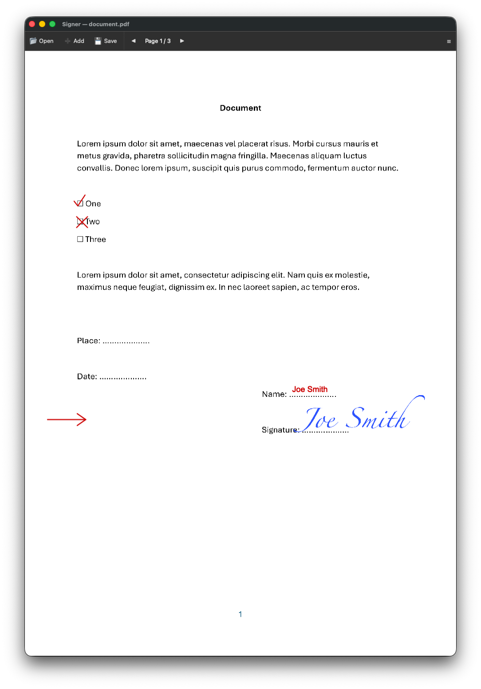

# Signer

A lightweight, cross-platform (Windows, macOS, Linux) desktop app for placing a scanned
signature — and other annotations — on top of a document, then exporting or printing the
result. Built to replace a slow, all-manual workflow with a general-purpose image editor, with
just a few clicks.



## Features

- **Multi-format documents**: PDF, Word (`.docx`/`.doc`), ODT, and common image formats
  (JPG, PNG, BMP, WEBP, GIF, TIFF), including encrypted PDFs.
- **Annotations**: signature/image, checkmark, crossmark, line, arrow, rectangle/square,
  ellipse/circle, and free text (with current date/time presets), each with color, line width,
  move, resize, and duplicate.
- **Multi-selection**, undo/redo, copy/paste/cut across pages and documents.
- **Export** to JPG, PNG, PDF, TIFF, or BMP, with adjustable quality for lossy formats.
- **Reusable project files** (`.signer`) for recurring signing workflows — reapply a saved
  annotation layout to an updated document (e.g. a form you re-sign every month).
- **Cross-platform**: Windows, macOS, and Linux, distributed as a single-file executable.

See [FUNCTIONAL_SPECIFICATION.md](FUNCTIONAL_SPECIFICATION.md) for the full, current behavior.

## Workflow this optimizes

Signer is optimized for a quick, repeatable signing pass, not general-purpose document editing:

1. Open a document (or a saved `.signer` project, for a recurring one).
2. Drop a signature and any supporting marks (checkmark, date, initials, …) onto the page.
3. Nudge anything into place, if needed, by dragging or with the keyboard.
4. Export or print.
5. For documents you re-sign regularly (e.g. a monthly form), save a `.signer` project once;
   next time just swap in the updated document and the annotation layout reapplies automatically.

## Getting Started

```bash
git clone https://github.com/jmalenko/signer.git && cd signer
python3 -m venv .venv
source .venv/bin/activate              # Linux/macOS; use .venv\Scripts\activate on Windows
pip install -r requirements.txt

python main.py
python main.py -document examples/document.pdf -signature examples/signature.png
```

Requires Python 3.10+. Opening Word/ODT documents additionally requires LibreOffice (optional,
detected automatically or configured in `config.json`).

To build a single-file executable, see [DESIGN.md](DESIGN.md#1-commands).

## Documentation

| Document | Purpose |
|---|---|
| [REQUIREMENTS.md](REQUIREMENTS.md) | Business-level change log: motivation and key aspects per feature |
| [FUNCTIONAL_SPECIFICATION.md](FUNCTIONAL_SPECIFICATION.md) | Detailed, current-state functional specification |
| [DESIGN.md](DESIGN.md) | Commands (run/test/build), architecture, and design rationale |
| [TESTING.md](TESTING.md) | How to run and troubleshoot tests |

## License

GNU General Public License v3.0 — see [LICENSE](LICENSE).
